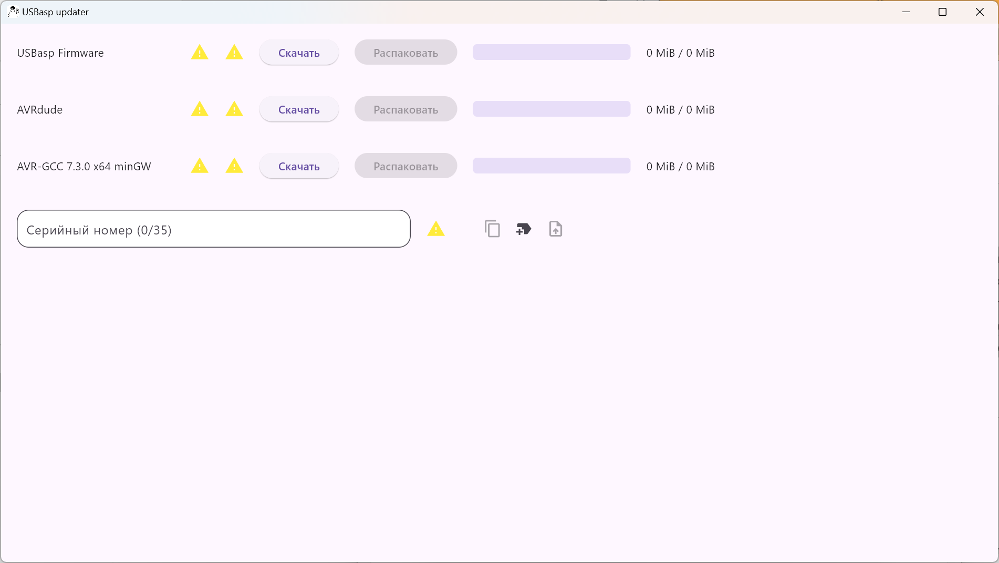

# Serial Number Generator and USB-ASP Firmware Uploader

---

## Overview
This project provides a Flutter-based desktop application for generating, building, and uploading AVR firmware, specifically targeting devices with `USBasp` programmers. The application is designed to assist users in generating unique serial numbers for their devices, compiling the firmware using `avr-gcc`, and flashing the firmware using `avrdude`. The app also offers an intuitive user interface, including progress indicators for compilation and flashing, as well as feedback on the success or failure of the operations.



---

## Features
1. **Serial Number Generation & Formatting**: 
   - Automatically generate 32-character alphanumeric serial numbers.
   - Supports custom serial number input with automatic formatting (inserting hyphens at appropriate positions).
   - Converts Cyrillic input to Latin characters.
   
2. **Firmware Compilation**:
   - The app uses `avr-gcc` to compile source files into `.hex` files for uploading to the microcontroller.
   - Supports custom flags for compilation, including setting the device’s serial number as a compile-time macro.

3. **Firmware Flashing**:
   - Uses `avrdude` to flash the compiled `.hex` firmware to the device via `USBasp`.
   - Provides detailed logging and progress updates during the flashing process.

4. **Progress and Result Feedback**:
   - Real-time progress updates during compilation and flashing.
   - Clear success or failure feedback for both steps.
   
---

## Usage

1. **Download and Unpack all Dependencies**:
   - Download next to each dependency and it will be saved to your device
   - After downloading, the *'Unpack'* button will be available, which will allow you to extract the files
   - After all files have been extracted, the next stage *"Upload"* will be available

2. **Serial Number Input**:
   - The app provides a text field for entering or generating the device serial number.
   - You can manually input a serial number, and the app will auto-format it (with hyphens at appropriate intervals).
   - The app automatically converts Cyrillic characters to their Latin equivalents during input.

3. **Compiling the Firmware**:
   - Once the serial number is entered and the `USBasp`, `avrdude`, and `avr-gcc` paths are set, click on the *"Compile"* button to compile the AVR firmware.
   - Progress of the compilation will be shown as a percentage.

4. **Flashing the Device**:
   - After successful compilation, click the *"Upload"* button to flash the firmware to the device.
   - The flashing progress will be displayed, and upon completion, you will see a success or failure message.

---

## Installation

1. **Clone the Repository**:
   ```bash
   git clone https://github.com/chagin0leg/USBasp-updater.git
   cd USBasp-updater
   ```

2. **Install Dependencies**:
   Install the required Dart and Flutter packages by running:
   ```bash
   flutter pub get
   ```

---

## Project Structure

- **upload.dart**: This file contains the core logic for serial number formatting, firmware compilation, and flashing.
- **dependencies.dart**: Lists and imports necessary dependencies for the project.
- **lib/**: The main folder where the Flutter widgets and business logic are stored.
- **assets/**: Folder to store resources such as the app's icons.
- **main.dart**: The entry point for the Flutter application.

---

## Notes

- Always verify the correctness of the connected USBasp programmer to avoid damage to your AVR device.
